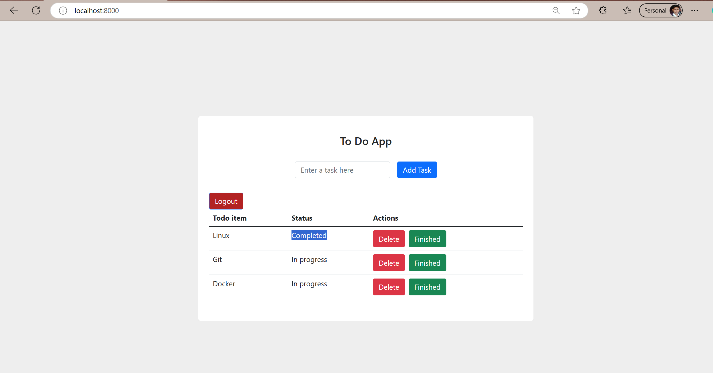
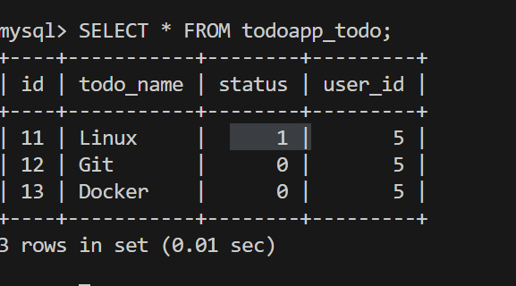

---

# Two-Tier App

A simple two-tier web application using Docker, Django, and a database.

## Prerequisites

Before running the application, ensure the following are installed:

- **Docker Desktop** (for managing Docker containers)
- Docker Compose
- Python 3.8+
- pip (Python package manager)

## Installation

1. Clone the repository:

   ```bash
   git clone https://github.com/Tanmay100000/two-tier-app.git
   cd two-tier-app
   ```

2. Set up your environment variables in a `.env` file:

   ```env
   DATABASE_NAME=your_db_name
   DATABASE_USER=your_db_user
   DATABASE_PASS=your_db_password
   DATABASE_HOST=localhost
   DATABASE_PORT=5432
   SECRET_KEY=your_SECRET_KEY
   DEBUG=your_DEBUG
   ```

3. Build the Docker images:

   ```bash
   docker-compose build
   ```

4. Start the application:

   ```bash
   docker-compose up -d
   ```

---

This update ensures users know that Docker Desktop is required to run the app.


---

## Application and Database Screenshots

Once the application is up and running, you can access the frontend by navigating to `http://localhost:8000`.

### Frontend Screenshot




### Database Screenshot

This screenshot demonstrates the application connected to the database.




---

